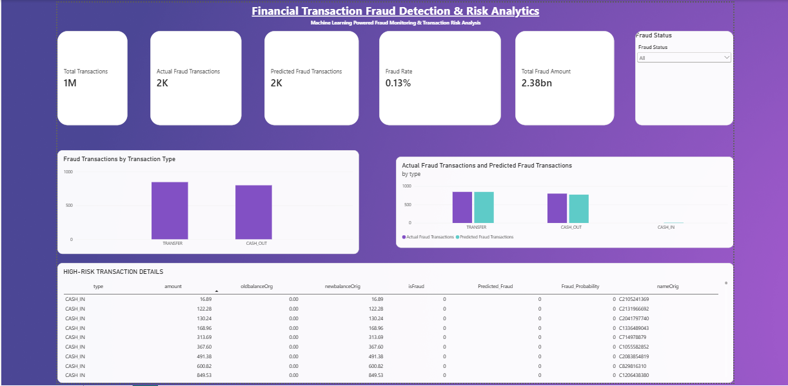

# Financial Transaction Fraud Detection & Risk Analytics

## Project Overview

This project develops a machine learning-based fraud detection and risk analytics solution for financial transactions.

The objective is to identify potentially fraudulent transactions from a highly imbalanced transaction dataset and provide meaningful fraud insights through a Power BI dashboard.

The project covers the complete analytics workflow from data understanding and exploratory analysis to machine learning model development, evaluation, fraud prediction, and business reporting.

---

## Business Problem

Financial transaction fraud can result in significant financial losses and operational risk.

Traditional rule-based fraud detection methods may fail to identify complex transaction patterns. The goal of this project is to use historical transaction data and machine learning techniques to:

- Identify fraudulent transactions
- Analyze fraud patterns across transaction types
- Compare multiple classification models
- Estimate fraud probability for transactions
- Support fraud monitoring through an interactive dashboard

---

## Dataset

The project uses the **PaySim Synthetic Financial Transactions Dataset**.

PaySim simulates mobile money transactions and contains more than **6.3 million transaction records**.

Key fields include:

- Transaction type
- Transaction amount
- Sender account balances
- Receiver account balances
- Fraud indicator
- Rule-based fraud flag
- Transaction time step

The dataset is highly imbalanced, with only a small proportion of transactions classified as fraudulent.

> Note: The dataset is synthetic and is used for educational and analytical purposes.

---

## Tools & Technologies

- Python
- Pandas
- NumPy
- Matplotlib
- Seaborn
- Scikit-learn
- Jupyter Notebook
- Power BI
- GitHub

---

## Project Workflow

```text
Transaction Data
      ↓
Data Understanding
      ↓
Data Cleaning
      ↓
Exploratory Data Analysis
      ↓
Data Preprocessing
      ↓
Train/Test Split
      ↓
Machine Learning Models
      ↓
Model Evaluation & Comparison
      ↓
Fraud Prediction & Probability
      ↓
Power BI Dashboard
      ↓
Business Insights
```

---

## Data Cleaning & Preprocessing

The preprocessing stage included:

- Checking missing values
- Checking duplicate transactions
- Validating transaction and balance values
- Removing high-cardinality account identifiers from model training
- Encoding transaction types using dummy variables
- Separating input features and fraud target
- Using stratified train/test splitting to preserve fraud proportions
- Scaling numerical variables for Logistic Regression

The existing `isFlaggedFraud` field was excluded from model inputs to avoid relying on an existing rule-based fraud flag when training the machine learning models.

---

## Exploratory Data Analysis

EDA was performed to understand:

- Normal vs fraudulent transaction distribution
- Fraud cases by transaction type
- Fraud rate by transaction type
- Fraud transaction amounts
- Sender account balance behavior
- Existing fraud flags compared with actual fraud cases
- Correlations between numerical variables

The analysis showed a severe class imbalance between normal and fraudulent transactions.

---

## Machine Learning Models

Three classification models were developed and compared:

### Logistic Regression
Used as a baseline classification model with balanced class weights.

### Decision Tree Classifier
Used to capture nonlinear transaction patterns through decision-based rules.

### Random Forest Classifier
Used as an ensemble learning model combining multiple decision trees.

Class balancing was considered because fraudulent transactions represent only a very small proportion of the dataset.

---

## Model Evaluation

Models were evaluated using:

- Accuracy
- Precision
- Recall
- F1 Score
- Classification Report
- Confusion Matrix

For fraud detection, Precision, Recall, and F1 Score were considered alongside Accuracy because overall accuracy alone can be misleading for highly imbalanced datasets.

The final model was selected based on model comparison, with particular attention to the F1 Score.

---

## Power BI Dashboard

The machine learning prediction results were used to build an interactive Power BI fraud monitoring dashboard.

### Dashboard KPIs

- Total Transactions
- Actual Fraud Transactions
- Predicted Fraud Transactions
- Fraud Rate
- Total Fraud Amount

### Dashboard Analysis

- Fraud Transactions by Transaction Type
- Actual vs Predicted Fraud by Transaction Type
- High-Risk Transaction Details
- Fraud Status Filtering

---

## Dashboard Preview



---

## Business Insights

The dashboard and analysis help identify:

- Transaction types with higher fraud activity
- Differences between actual and model-predicted fraud
- High-risk transactions requiring further investigation
- Transaction amounts associated with fraudulent activity
- Overall fraud exposure within the analyzed transaction sample

These insights can support fraud investigation and risk-monitoring workflows.

---

## Project Limitations

- The PaySim dataset is synthetic and does not represent live banking transactions.
- The project uses historical simulated transaction data rather than a live streaming system.
- Therefore, the solution should be considered a **fraud detection and risk analytics prototype**, not a production real-time fraud detection platform.
- Model performance on real financial data may differ.
- Further feature engineering, threshold optimization, time-based validation, and production monitoring could improve the solution.

---

## Repository Files

```text
Financial-Transaction-Fraud-Detection/
│
├── Real-Time Financial Transaction Fraud Detection & Risk Analytics.ipynb
├── Dashboard.png
└── README.md
```

The original PaySim dataset, prediction output CSV, and Power BI `.pbix` file are not included in this repository because of their large file sizes.

---

## How to Run

1. Download the PaySim dataset.
2. Open the Jupyter Notebook.
3. Update the dataset file path if required.
4. Run the notebook cells in sequence.
5. Review EDA and machine learning model results.
6. Generate fraud predictions for dashboard analysis.

---

## Future Improvements

- Advanced feature engineering
- Hyperparameter tuning
- Fraud probability threshold optimization
- Time-based model validation
- Additional imbalance-handling techniques
- Real-time transaction scoring pipeline
- Model monitoring and retraining

---

## Author

**Ajai M**  
Aspiring Data Analyst

Skills: Python | SQL | Excel | Power BI | Machine Learning
